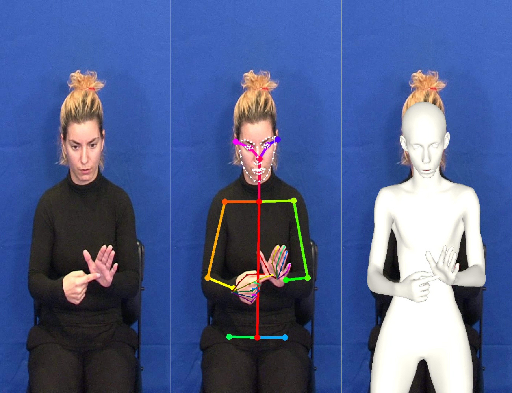

## 3D-Hands-Face-and-Body-Extraction-for-SLR

**Abstract**: For the problem of Sign Language Recognition (SLR), the majority of the information is included in three main channels; hand gestures, facial expression and body pose.
While many state-of-the-art works have managed to deeply elaborate on these features independently, to the best of our knowledge, no work has adequately combined all these three information channels, particularly in 3D, to efficiently recognize Sign Language. In this work, we employ SMPL-X, a contemporary parametric model that enables joint extraction of 3D body shape, face and hands information from a single image. 
We use this holistic 3D reconstruction for SLR, demonstrating that it leads to higher accuracy than recognition from raw RGB images, or 2D skeletons.
Simultaneously, we demonstrate the importance of combining the information from all three channels, to achieve the best recognition results. 

**Keywords**: 3D body reconstruction, Independent Sign Language Recognition, Greek Sign Language, Facial Expression, Gesture Recognition}

